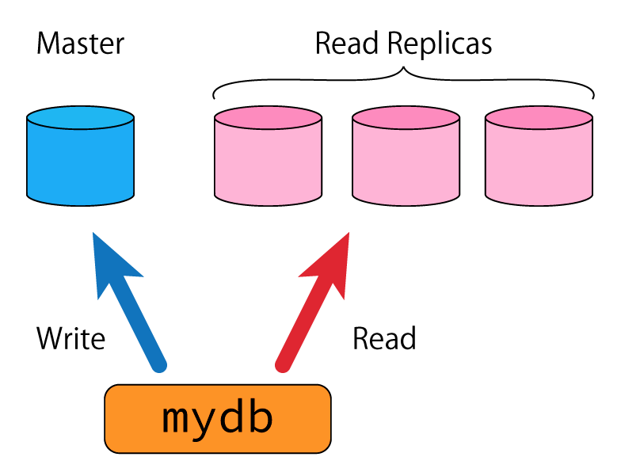

<p align="center">
<b font-size="400px">MYDB<b>
============
</p>

<p align="center">Connect with one master DB and multiple read replicas</a></p>

MYDB is a GO package that provides an automatic route read-only queries to read replicas, and all other queries to the master DB (see diagram below), without the user having to be aware of it.



This package is very similiar to package `database/sql`.

Getting Started
===============

## Installing

To start using mydb, install Go and run `go get`:

```sh
$ go get -u github.com/rosspatil/sql-db-mocking
```

This will retrieve the library.

## Get the instance and start using it
Get the instance of DB Object and perform generic sql operations. You have to provide 
one master db instance and atleast one replica instance
```go

func New(master *sql.DB, readreplicas ...*sql.DB) (*DB, error)

```

